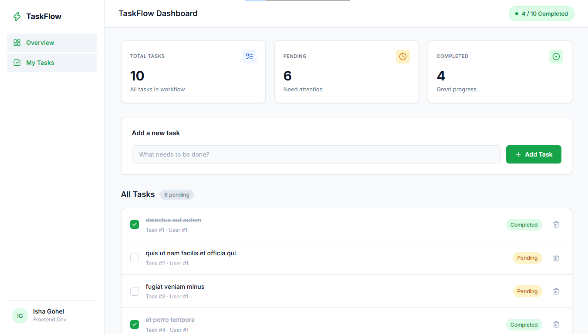
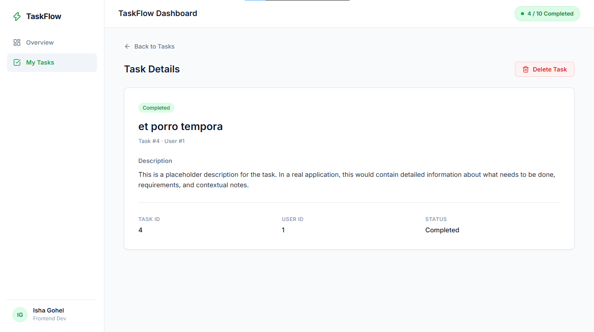

# TaskFlow Dashboard

A modern, responsive TaskFlow Dashboard application built with **React**, **React Router DOM**, **Lucide Icons**, and **Plain CSS**. Features complete CRUD operations, dynamic stats, responsive sidebar layout, loading/error states, and detailed task management views.

## Screenshots & Preview

### 📊 Dashboard Overview


### 📋 Task Details View


---

## Tech Stack

- **React** (v19)
- **React Router DOM** (v7)
- **Plain CSS** (CSS Variables, Flexbox, Grid, Responsive Breakpoints)
- **Lucide React** (Clean, lightweight SVG icons)
- **Fetch API**
- **Vite** (Build tool)

## API Integration

Uses [JSONPlaceholder](https://jsonplaceholder.typicode.com) as a mock REST API.

| Method | Endpoint | Description |
|--------|----------|-------------|
| GET | `/todos?_limit=10` | Fetch all tasks on mount |
| GET | `/todos/:id` | Fetch single task details |
| POST | `/todos` | Create a new task (optimistic state update) |
| PATCH | `/todos/:id` | Update task completion status |
| DELETE | `/todos/:id` | Remove a task |

> **Note:** JSONPlaceholder returns mock responses for write operations (`POST`, `PATCH`, `DELETE`). Local React state is updated to reflect all CRUD actions seamlessly.

## Key Features

- **Sidebar & Topbar Navigation**: 240px fixed sidebar with active menu states, mobile menu drawer, and top bar user profile / notifications.
- **Statistics Overview**: Live stats cards displaying Total Tasks, Pending Tasks, and Completed Tasks.
- **Task Management**:
  - Add task form with progress indicator / disabled state.
  - Interactive task list with custom checkbox toggles, completion line-through, and status badges.
  - Delete task action with optimistic UI update.
- **Task Details View**: Dedicated details page with clear visual hierarchy, task metadata (Task ID, User ID, Status, Description), and deletion capability.
- **State Handling**: Loading spinner, error fallback with retry capability, and empty state handler.
- **Responsive Layout**: Designed for Desktop (sidebar), Tablet, and Mobile (drawer menu).

## Getting Started

### Prerequisites

- Node.js (v18 or higher)
- npm

### Installation

```bash
git clone https://github.com/isha-gohel181/task_flow_dashboard.git
cd task_flow_dashboard
npm install
```

### Development Server

```bash
npm run dev
```

Open [http://localhost:5173](http://localhost:5173) in your browser.

### Build Production Bundle

```bash
npm run build
```

## Project Structure

```
src/
├── components/
│   ├── AddTask.jsx       # Card container for adding new tasks
│   ├── EmptyState.jsx    # Empty task list fallback
│   ├── ErrorState.jsx    # Error alert with retry action
│   ├── Loading.jsx       # Animated loading spinner
│   ├── Sidebar.jsx       # Fixed/responsive sidebar navigation
│   ├── StatsCards.jsx    # Summary stats cards (Total, Pending, Completed)
│   ├── TaskItem.jsx      # Task item row with custom checkbox & status badge
│   ├── TaskList.jsx      # Task list container
│   └── Topbar.jsx        # Sticky top header with title and notifications
├── pages/
│   ├── Dashboard.jsx     # Main dashboard view
│   └── TaskDetails.jsx   # Task details view with hierarchy & metadata
├── services/
│   └── api.js            # Fetch API service layer
├── App.jsx               # Main application container & Router
├── App.css               # Component layout & UI styles
├── index.css             # Design tokens & base global styles
└── main.jsx              # Entry point
```
